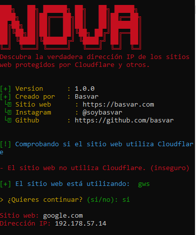
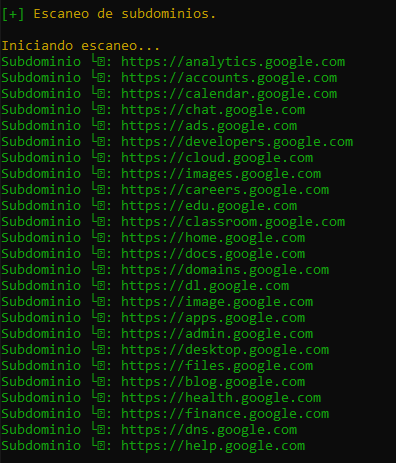

# Nova

Esta herramienta desarrollada en Python permite obtener de forma eficiente la dirección IP asociada a un dominio especificado, así como realizar un escaneo básico de sus posibles subdominios. Es útil para tareas de análisis de red, pruebas de seguridad y reconocimiento en entornos de administración de sistemas o auditorías web.

¿Cómo funciona?
======
Solo tendremos que ingresar el nombre de dominio y en automatico comenzara:

Una vez ingresado hara en automatico un escaneo de subdominios del dominio:

======
Nota: El archivo **bv.txt** es el encargado de hacer el escaneo de subdominios, puedes personalizar el archivo para un escaneo mejorado.
======

Creador
======
Basvar, inc

basvar.com

contacto@basvar.com